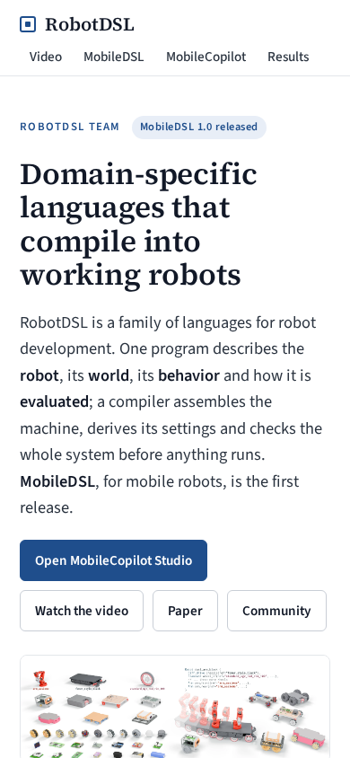
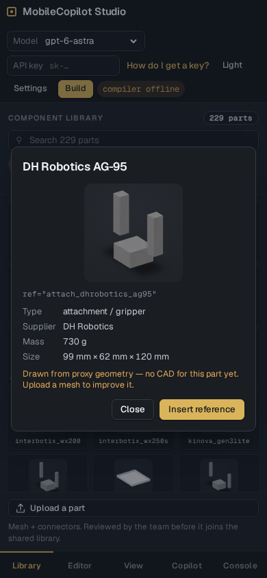

# Release UI verification

Verified on 2026-09-21 with Chromium 153, desktop and touch/phone emulation. No physical-phone or Safari testing has been performed.

The production build was served under `/robotdsl-site/`, including `/robotdsl-site/studio/`. All 37 checks passed:

- At 320, 390, 768 and 1440 CSS pixels: page width, seven section links, table scrolling, code whitespace, key guide, Upload dialog layout and theme persistence.
- At 390 and 1440 pixels: playback of the paper video and all three robot demonstrations, plus keyboard navigation of the demo tabs.
- At 320 and 390 pixels: bottom navigation before/after dismissing the offline notice, one selected panel, and touch inspection followed by explicit part insertion.
- Report and Upload service errors are readable, and modal focus stays inside the dialog.

The maintained Studio source also passes 13 browser scenarios, including native drag-and-drop at the drop position, editor persistence after reload, Upload retries with retained files, and real WebGL capture saved by a local report service as `view.png`.

Build, Copilot, exports, uploads and report submissions still require the hosted service. The service's renderer must include the canvas-capture hook for report screenshots; the dialog explains when capture is unavailable. No test reports or parts were submitted to a public service.

## Phone screenshots

